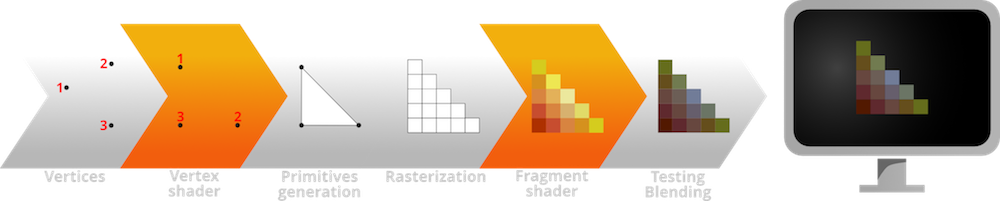
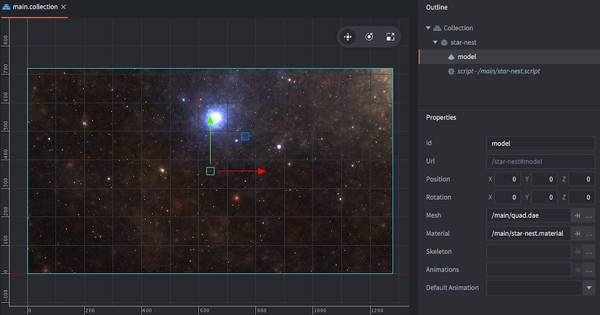

# Shadertoy sample

This is a sample of a shader taken from Shadertoy and ported to Defold. The shader is a fragment shader called "Star Nest" that was created by Pablo Román Andrioli (username “Kali” on Shadertoy). You can find the original code [here](https://www.shadertoy.com/view/XlfGRj).

This document explains how it was setup to run properly in Defold.

Try [building and running](defold://build) the sample to see the shader in action.

## Rendering

To understand how this sample project works, you must first get a basic understanding on how the rendering pipeline in GPU:s work.

Everything that is about to be drawn to the screen are expressed as *vertices*, points in 3D space that make out the shape of objects. A sprite's shape, for instance, is a rectangle described by its 4 corner vertices. On its way to the final on-screen form, all graphics data pass through two shader programs that are run on the GPU:

* The *vertex shader* does computations on each component’s primitive polygon shape, projecting its vertices from 3D to the screen's 2D. The program is run once for each vertex.

* Primitives are generated from the vertices.

* The primitives are *rasterized*, or divided into pixels (or "fragments").

* The *fragment shader* decides the color of each pixel of the 2D shape should have. The decision decision can be based on texture lookup (one or several), calculation or a combination. For a sprite, the fragment shader does a texture lookup, finding the color for each pixel on its corresponding position on the sprite texture image. The program is run once for each pixel.

* The final result depends on how the colored shape should be blended with other overlapping graphics if there is translucency involved.

(See the [Shader manual](https://www.defold.com/manuals/shader/) for a more in-depth explanation on shaders.)

## Materials

Before a set of vertices for an object are sent through the shader pipeline, the engine needs to do the following:

* Specify which vertex and fragment shader program to use to process the object data.
* Specify vertex and fragment constants that are used in the shader programs.
* Set samplers that are used in the fragment shader to do texture lookup.
* Since the render pipeline is fully scriptable it must be possible to specify in what pass the object should be drawn. This is done by setting *tags* on the material and then use these to filter objects in render predicates in the render script.

Defold uses *materials* to specify all those things. The material set on the sample quad model (["/main/star-nest.material"](defold://open?path=/main/star-nest.material)) contains the following information:

* Reference to a very basic vertex shader program (["/main/star-nest.vp"](defold://open?path=/main/star-nest.vp)) that is used to calculate vertex positions.

* Reference to the "Star Nest" fragment shader (["/main/star-nest.fp"](defold://open?path=/main/star-nest.fp)), adapted for Defold. This is the program that creates the whole star effect.

* A *Vertex constant* named "view_proj". This is a uniform that is specified to contain an engine supplied constant, an automatically calculated matrix with view and projection that we use to transform the vertices. This constant is passed to the vertex shader as a uniform.

* A *Fragment constant* named "time". This is a user type uniform, meaning that the engine will not automatically set it, instead that is up to us, either to a static value in the material, or dynamically in a script. The constant is passed to the fragment shader as a uniform.

* No *Samplers* are set in the material since the fragment shader do not rely on any texture sampling.

* The tag "tile" is set on the material. This means that the quad is rendered in the same pass as tiles and sprites, which is how the default render script works.

## The sample setup

This sample is a staightforward setup. The bootstrap collection (["/main/main.collection"](defold://open?path=/main/main.collection)) contains:

* A single game object (called "star-nest").
* This game object contains a model component and a script.
* The model component uses a simple quadratic mesh (["/main/quad.dae"](defold://open?path=/main/quad.dae)). The mesh is 2x2 units large (extends from -1 to 1 on the X and Y axis).
* The model is scaled 640 times along X and 360 times along Y to cover the full 1280x720 resolution.
* The model component uses the custom material (["/main/star-nest.material"](defold://open?path=/main/star-nest.material)).
* The script component (["/main/star-nest.script"](defold://open?path=/main/star-nest.script)) sets a fragment constant (time) each frame. This constant is passed to the fragment shader to make it animate.

That's it!

Check out the [documentation pages](https://defold.com/learn) for examples, tutorials, manuals and API docs.

If you run into trouble, help is available in [our forum](https://forum.defold.com).

---